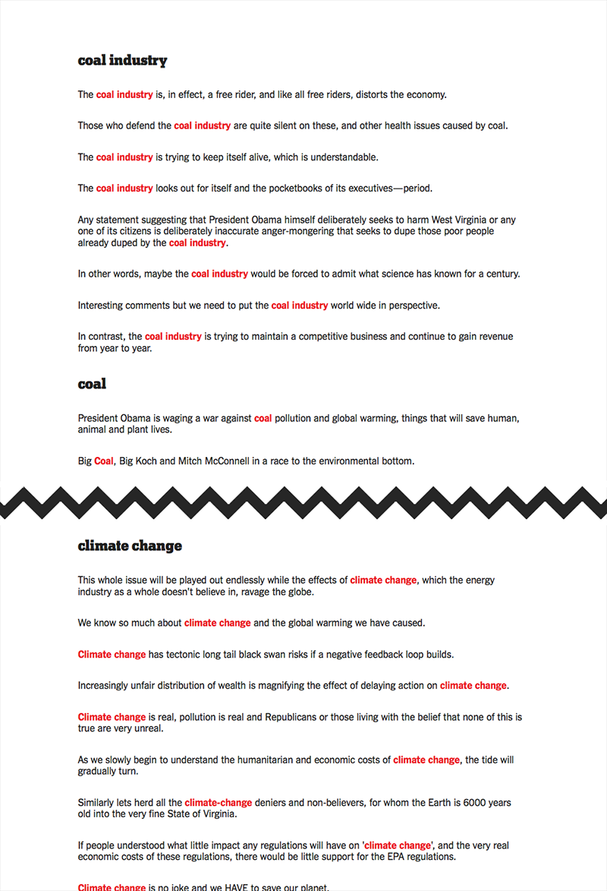

# Geiger: Comment Highlights

Here I propose an automated system for grouping similar comments and then identifying the best representative from each group. These selections can be used to construct a high-level summary of the discussion in the comments, which is useful to readers who may be interested in the general response towards a piece, but unwilling to wade through many comments. This summary can function as an alternate entry point to the comments if these highlights link back to their original comments.

## Motivation

On popular or controversial stories, there may be hundreds to thousands of comments. In these cases it is unrealistic to assume that anyone will read even a significant fraction of the comments. Even in more modest amounts (<100), there may still be too many comments to read all the way through. Making sense of how people are reacting and what the general opinions are towards something is a very noisy and labor-intensive process. Considering the varying quality and sheer quantity of comments, readers may be intimidated away and join more manageable discussions on other platforms. It is possible that a reader still wants a general understanding of the sentiment or reaction towards a particular piece, and this could provide an entry point into the conversation on the NYT site.

## Hypothesis

If we can extract highlights from the comments for a given article, we can present them as a summary of reaction towards a piece and the popular perspectives which are represented, quantifying the support for each. Readers can use this to orient themselves in the discussion around an article very quickly and immediately identify sub-conversations they can be a part of. This could increase engagement and time spent on the site.

We can cluster the comments for a given article using an incremental hierarchical approach, which allows us to construct a cluster tree which can be persisted to disk or memory. With an incremental approach, new comments can be incorporated on a regular basis without needing to reconstruct the entire tree.

In particular, we want to form comment groups which have:

- similar semantic content
- similar sentiment

Under the assumption that we are likely to be clustering opinions towards some subject or subjects, the comments might be clustered on the following features:

- sentiment
- subjectivity metrics
- text
- article relevance
- named entities or keywords

Once the clusters are formed, there are two options:

- From these clusters we can select a representative comment, which is the "best" of the group by some metric (e.g. most recommended, highest rated, or most relevant).
- From these clusters we can select sentences or phrases which best represent the group.

## Existing Implementations

Yelp uses such a system to provide users with a high-level summary of the general opinion towards a service:

Yelp extracts sentences which are representative of the aggregate reviews for particular "aspects" of the service, such as "craft beer" in the example above. They also present how many reviews are aligned with the representative to provide an impression of the support for that opinion.

The YUMM project provides an implementation for a similar functionality, also on Yelp data: [https://github.com/Fossj117/opinion-mining](https://github.com/Fossj117/opinion-mining).

To my knowledge, no one has yet tried a similar technique on comments.

## Evaluation

I have developed a system which applies a variety of extraction strategies to the comments of any arbitrary NYT article and displays their outputs side-by-side. Using this system, we can develop some ground truth data with human annotators so we can automatically measure the performance of Geiger.

Alternatively, we can use A/B testing and develop a ranking of which strategies are preferred, comparing against human-selected highlights. We could develop a Chrome extension which mocks these highlights into the NYT site to simulate the experience.

## Challenges

### Performance

In the current prototype, when the number of comments exceeds ~500, the time for incorporating a new comment grows dramatically. This speed should be better for production usage.

### Evaluation

As far as I know, there is no ground-truth data to evaluate the cluster quality against. What's the best way to test if the results look good?

### Determining cluster cutoffs

Different kinds of articles may have different cluster structures - for instance, for an article in which there is a consensus opinion, we would expect the clusters to be much more nuanced. For a very polarizing article, we could expect the clusters to be very distinct. One challenge is in determining where to set off the cutoffs for clusters in each case.

## Current Status

A very early prototype is available at [https://github.com/ftzeng/geiger](https://github.com/ftzeng/geiger).

## References

- S. Blair-Goldensohn, K. Hannan, R. McDonald, T. Neylon, G. A. Reis, J. Reynar. Building a Sentiment Summarizer for Local Service Reviews. _NLPIX2008_, 2008.
- Y. Lu, C. Zhai, N. Sundaresan. Rated Aspect Summarization of Short Comments. _WWW_, 2009.
- M. Hu, B. Liu. Mining and Summarizing Customer Reviews. _KDD'04_, 2004.
- M. Hu, B. Liu. Mining Opinion Features in Customer Reviews. 2004.
- R. Agrawal, R. Srikant. Fast Algorithms for Mining Association Rules. _Proceedings of the 20th VLDB Conference_, 1994.
- T. Mikolov, I. Sutskever, K. Chen, G. Corrado, J. Dean. Distributed Representations of Words and Phrases and their Compositionality. 2013.
- Q. Le, T. Mikolov. Distributed Representations of Sentences and Documents. 2014.
- Y. Kim. Convolutional Neural Networks for Sentence Classification. 2014.
- R. Johnson, T. Zhang. Effective Use of Word Order for Text Categorization with Convolutional Neural Networks. 2015.