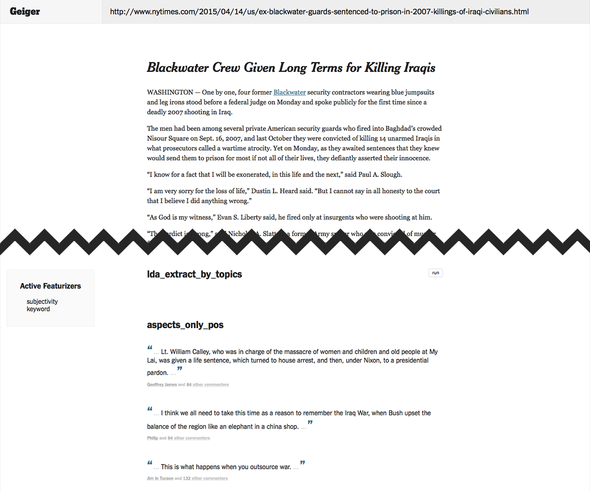

# Geiger
## Get a sense of the comments from a safe distance

Here I propose an automated system for grouping similar comments and then identifying the best representative from each group. These selections can be used to identify the popular themes being discussed and construct a high-level summary of the discussion in the comments, which is useful to readers who may be interested in the general response towards a piece, but unwilling to wade through many comments. This summary can function as an alternate entry point to the comments if these highlights link back to their original comments.

Yelp uses such a system to provide users with a high-level summary of the general opinion towards a service:

Yelp extracts sentences which are representative of the aggregate reviews for particular "aspects" of the service, such as "craft beer" in the example above. They also present how many reviews are aligned with the representative to provide an impression of the support for that opinion.

The YUMM project provides an implementation for a similar functionality, also on Yelp data: [https://github.com/Fossj117/opinion-mining](https://github.com/Fossj117/opinion-mining).

To my knowledge, no one has yet tried a similar technique on comments.

## Motivation

- About 20% of NYT commentable articles since 2014 have 100 or more comments. On popular or controversial stories, there may be hundreds to thousands of comments - of the entire comments dataset, about 2% (5015 articles) had at least 500 comments and 139 articles had over 2000 comments. In these cases it is unrealistic to assume that anyone will read even a significant fraction of the comments.
- Even in more modest amounts, there may still be too many comments to read all the way through. On average, commentable articles have a mean of 60 comments. If we look at the ~52000 articles with at least 50 comments, the mean rises to 226.
- Making sense of how people are reacting and what the general opinions are towards something is a very noisy and labor-intensive process. There is a great deal of repetition and redundancy and scattered points, so it is not necessarily time well spent.
- Considering the varying quality and sheer quantity of comments, readers may be intimidated away and end up joining more manageable discussions on other platforms.
- It is possible that a reader still wants a general understanding of the sentiment or reaction towards a particular piece, and Geiger could provide an entry point into the conversation on the NYT site.

## Hypothesis

If we can extract highlights from the comments for a given article, we can present them as a summary of reaction towards a piece and the popular perspectives which are represented, quantifying the support for each. Readers can use this to orient themselves in the discussion around an article very quickly and immediately identify sub-conversations they can be a part of. This could increase engagement and time spent on the site.

Through identification of key aspects, we can group sentences by what they are talking _about_ and use this to surface general topics being discussed in the comments.

Once the we form these "talking about" groups, there are two options:

- We can select a representative sentence for each group, which is the "best" of the group by some metric (e.g. most recommended, highest rated, or most relevant).
- We can present the top _n_ sentences from each group (ranked by some metric) to present a wider view of the points being made.

## Evaluation

- We could do internal A/B testing, comparing Geiger's groupings against human-selected groupings.
- We could develop a Chrome extension which mocks these highlights into the NYT site to simulate the experience.

## Challenges

- The main challenge is accurately identifying the aspects people are talking about and displaying only the salient/interesting ones.
- A secondary challenge is figuring out best to display these "talking about" groups - how many sentences should be shown from each?

## Current Status

A functional prototype is available at [https://github.com/ftzeng/geiger](https://github.com/ftzeng/geiger).

## Future Directions

This system identifies comments which are discussing the same thing, but a useful, though technically challenging, extension would be to further group comments according to opinion or the point being made.

In particular, we would want to form comment groups which have:

- similar semantic content
- similar sentiment

The challenges here are that it is generally quite difficult to automatically group text according to semantics, especially with comments - such a task will be sensitive to the tricky aspects of language like sarcasm.

A screenshot of initial explorations for this task is below:

This task might be made easier with a larger amount of training data. I've developed a web app for annotating training data which can be used to develop some ground truth data with human annotators, but it is a very time-consuming process.

## References

- S. Blair-Goldensohn, K. Hannan, R. McDonald, T. Neylon, G. A. Reis, J. Reynar. Building a Sentiment Summarizer for Local Service Reviews. _NLPIX2008_, 2008.
- Y. Lu, C. Zhai, N. Sundaresan. Rated Aspect Summarization of Short Comments. _WWW_, 2009.
- M. Hu, B. Liu. Mining and Summarizing Customer Reviews. _KDD'04_, 2004.
- M. Hu, B. Liu. Mining Opinion Features in Customer Reviews. 2004.
- R. Agrawal, R. Srikant. Fast Algorithms for Mining Association Rules. _Proceedings of the 20th VLDB Conference_, 1994.
- T. Mikolov, I. Sutskever, K. Chen, G. Corrado, J. Dean. Distributed Representations of Words and Phrases and their Compositionality. 2013.
- Q. Le, T. Mikolov. Distributed Representations of Sentences and Documents. 2014.
- Y. Kim. Convolutional Neural Networks for Sentence Classification. 2014.
- R. Johnson, T. Zhang. Effective Use of Word Order for Text Categorization with Convolutional Neural Networks. 2015.